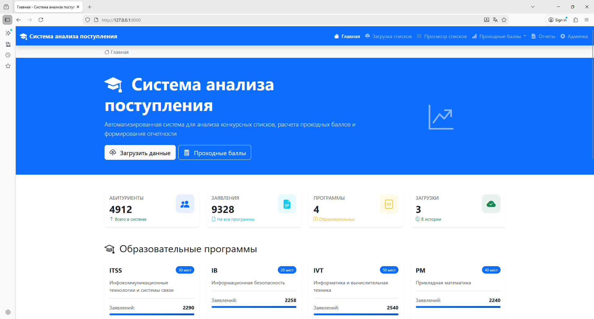
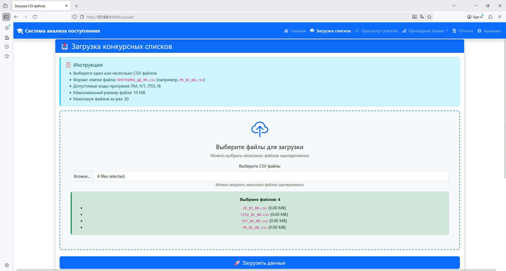
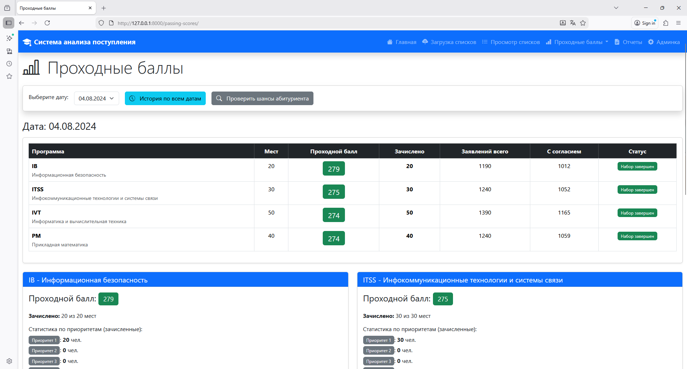
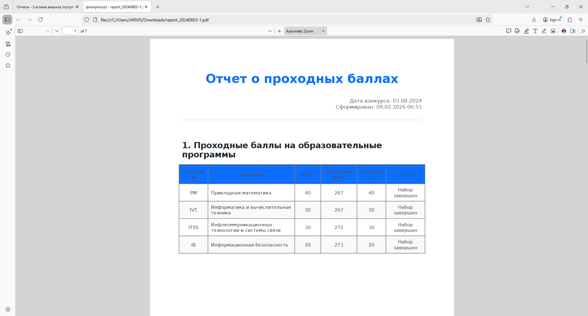

# 🎓 Система анализа поступления

[](https://www.python.org/downloads/)
[](https://www.djangoproject.com/)
[](https://www.postgresql.org/)
[](LICENSE)
[](https://www.python.org/dev/peps/pep-0008/)

> Автоматизированная система для анализа конкурсных списков, расчета проходных баллов и визуализации динамики поступления в вуз

---

## 📋 Содержание

- [Функционал](#-функционал)
- [Технологии](#-технологии)
- [Требования](#-требования)
- [Установка](#-установка)
- [Настройка БД](#-настройка-бд)
- [Запуск проекта](#-запуск-проекта)
- [Использование](#-использование)
- [Скриншоты](#-скриншоты)
- [Материалы](#-материалы)
- [Авторы](#-авторы)
- [Лицензия](#-лицензия)

---

## ✨ Функционал

### Основные возможности

- ✅ **Загрузка данных** - массовая загрузка CSV файлов (20 файлов за раз)
- ✅ **Расчет проходных баллов** - алгоритм глобального зачисления с учетом приоритетов
- ✅ **Визуализация динамики** - интерактивные графики изменения проходных баллов
- ✅ **Генерация отчетов** - автоматическое создание PDF отчетов с таблицами и графиками
- ✅ **Просмотр списков** - фильтрация, сортировка, пагинация конкурсных списков
- ✅ **Статистический анализ** - детальная статистика по программам и датам
- ✅ **Адаптивный интерфейс** - современный дизайн на Bootstrap 5
- ✅ **История загрузок** - отслеживание всех операций импорта данных

### Дополнительные функции

- 🔍 Поиск абитуриентов по ID
- 📊 Интерактивные графики Chart.js
- 📄 Экспорт данных в PDF
- 🎨 Цветовая индикация статусов (недобор/норма)
- ⚡ Оптимизированная загрузка (10,700 записей за 2.6 секунды)
- 🔐 Защита от SQL-инъекций и XSS
- 📱 Мобильная адаптация

---

## 🛠 Технологии

### Backend

| Технология | Версия | Назначение |
|------------|--------|------------|
| **Python** | 3.11+ | Основной язык программирования |
| **Django** | 5.0 | Web-фреймворк |
| **PostgreSQL** | 14+ | Реляционная СУБД |
| **psycopg2** | 2.9+ | PostgreSQL адаптер |
| **ReportLab** | 4.0+ | Генерация PDF |

### Frontend

| Технология | Версия | Назначение |
|------------|--------|------------|
| **Bootstrap** | 5.3 | CSS фреймворк |
| **Chart.js** | 4.4 | Библиотека графиков |
| **Bootstrap Icons** | 1.11 | Иконки |
| **JavaScript** | ES6+ | Интерактивность |

### Инструменты разработки

- **Git** - система контроля версий
- **pip** - менеджер пакетов Python
- **venv** - виртуальное окружение
- **Django Debug Toolbar** - отладка (dev)

---

## 📦 Требования

### Системные требования

- **ОС**: Windows 10/11, Linux, macOS
- **RAM**: минимум 4 GB
- **Диск**: 500 MB свободного места

### Программное обеспечение

- **Python**: 3.11 или выше
- **PostgreSQL**: 14 или выше
- **Git**: 2.30 или выше
- **pip**: 21.0 или выше

### Проверка установленных версий

```bash
python --version    # Python 3.11+
psql --version      # PostgreSQL 14+
git --version       # Git 2.30+
```

---

## 🚀 Установка

### 1. Клонирование репозитория

```bash
# Клонировать проект
git clone https://github.com/your-username/admission-analysis.git

# Перейти в директорию
cd admission-analysis
```

### 2. Создание виртуального окружения

**Windows:**
```bash
python -m venv venv
venv\Scripts\activate
```

**Linux/macOS:**
```bash
python3 -m venv venv
source venv/bin/activate
```

### 3. Установка зависимостей

```bash
# Обновить pip
pip install --upgrade pip

# Установить зависимости проекта
pip install -r requirements.txt
```

**Файл `requirements.txt`:**
```
Django==5.0.1
psycopg2-binary==2.9.9
reportlab==4.0.9
python-dotenv==1.0.0
Pillow==10.2.0
```

---

## 🗄 Настройка БД

### 1. Установка PostgreSQL

**Windows:**
- Скачать с [официального сайта](https://www.postgresql.org/download/windows/)
- Запустить установщик
- Запомнить пароль для пользователя `postgres`

**Linux (Ubuntu/Debian):**
```bash
sudo apt update
sudo apt install postgresql postgresql-contrib
sudo systemctl start postgresql
```

**macOS (Homebrew):**
```bash
brew install postgresql@14
brew services start postgresql@14
```

### 2. Создание базы данных

```bash
# Войти в PostgreSQL
psql -U postgres

# Создать БД
CREATE DATABASE admission_analysis;

# Создать пользователя (опционально)
CREATE USER admission_user WITH PASSWORD 'your_password';

# Выдать права
GRANT ALL PRIVILEGES ON DATABASE admission_analysis TO admission_user;

# Выйти
\q
```

### 3. Настройка переменных окружения

Создайте файл `.env` в корне проекта:

```bash
# .env
DEBUG=True
SECRET_KEY=your-secret-key-here-generate-with-django

# Database
DB_NAME=admission_analysis
DB_USER=postgres
DB_PASSWORD=your_password
DB_HOST=localhost
DB_PORT=5432

# Optional
ALLOWED_HOSTS=localhost,127.0.0.1
```

**Генерация SECRET_KEY:**
```bash
python -c "from django.core.management.utils import get_random_secret_key; print(get_random_secret_key())"
```

---

## ▶️ Запуск проекта

### 1. Применение миграций

```bash
# Создать таблицы в БД
python manage.py migrate

# Проверить миграции
python manage.py showmigrations
```

### 2. Загрузка начальных данных

```bash
# Загрузить образовательные программы
python manage.py init_programs
```

**Создается 4 программы:**
- **ПМ** (Прикладная математика) - 40 мест
- **ИВТ** (Информатика и вычислительная техника) - 50 мест
- **ИТСС** (Инфокоммуникационные технологии) - 30 мест
- **ИБ** (Информационная безопасность) - 20 мест

### 3. Создание суперпользователя (опционально)

```bash
python manage.py createsuperuser
```

Введите:
- Username: `admin`
- Email: `admin@example.com`
- Password: `********`

### 4. Запуск сервера разработки

```bash
python manage.py runserver
```

**Сервер запущен:** http://localhost:8000/

**Админ-панель:** http://localhost:8000/admin/

---

## 📖 Использование

### Генерация тестовых данных

```bash
# Сгенерировать CSV файлы
python generate_applicants_data.py
```

**Будут созданы 16 CSV файлов в директории `csv_files/`:**
- 4 даты: 01.08, 02.08, 03.08, 04.08
- 4 программы: PM, IVT, ITSS, IB

### Основные операции

#### 1. Загрузка конкурсных списков

1. Перейдите на страницу **"Загрузка данных"**
2. Перетащите 16 CSV файлов в зону загрузки (Drag & Drop)
3. Или нажмите **"Выберите файлы"** и выберите вручную
4. Нажмите **"Загрузить данные"**
5. Дождитесь завершения (~2-3 секунды)

**Результат:**
- Создано/обновлено абитуриентов
- Создано/удалено заявлений
- Статистика по программам и датам

#### 2. Расчет проходных баллов

1. Перейдите на **"Расчет проходных баллов"**
2. Выберите дату из списка
3. Нажмите **"Рассчитать"**
4. Просмотрите таблицу с результатами

**Показатели:**
- Проходной балл на каждую программу
- Количество зачисленных
- Статус (норма/недобор)

#### 3. Просмотр графиков динамики

1. Перейдите на **"История проходных баллов"**
2. Изучите интерактивные графики Chart.js
3. Наведите курсор на точки для деталей

#### 4. Генерация PDF отчета

1. Перейдите на **"Формирование отчетов"**
2. Выберите дату
3. Нажмите **"Сформировать PDF"**
4. Скачайте готовый документ

**Содержание отчета:**
- Проходные баллы по программам
- Графики динамики за 4 дня
- Списки зачисленных абитуриентов
- Детальная статистика

### Управляющие команды

```bash
# Очистить все данные
python manage.py clear_data --reset-ids --with-history --no-input

# Проверить состояние БД
python manage.py dbshell

# Создать резервную копию
python manage.py dumpdata > backup.json

# Восстановить из резервной копии
python manage.py loaddata backup.json
```

---

## 📸 Скриншоты

### Главная страница

*Обзор системы с основными метриками*

### Загрузка данных

*Интерфейс массовой загрузки CSV файлов*

### Расчет проходных баллов

*Таблица с результатами расчета*

### История динамики

*Интерактивные графики изменения баллов*

### PDF отчет

*Пример сгенерированного отчета*

---

## 📄 Материалы

**Проект:** [https://github.com/T1mleT/admission-analysis](https://github.com/T1mleT/admission-analysis)

**Видео:** [vk](https://github.com/your-username/admission-analysis/issues)

**Документация:** [Wiki](https://github.com/your-username/admission-analysis/wiki)

---

## 👥 Авторы

### Команда разработки

- **Тимофей Летуновский** - Team Lead, Backend Developer

- **Вадим Билера** - Frontend Developer

- **Дмитрий Нарижний** - Database Developer

### Благодарности

- Московская предпрофессиональная олимпиада школьников
- Django Community
- Bootstrap Team
- Chart.js Contributors

---

## 📄 Лицензия

Этот проект лицензирован под **MIT License** - см. файл [LICENSE](LICENSE) для деталей.

```
MIT License

Copyright (c) 2026 Admission Analysis Team

Permission is hereby granted, free of charge, to any person obtaining a copy
of this software and associated documentation files (the "Software"), to deal
in the Software without restriction, including without limitation the rights
to use, copy, modify, merge, publish, distribute, sublicense, and/or sell
copies of the Software, and to permit persons to whom the Software is
furnished to do so, subject to the following conditions:

The above copyright notice and this permission notice shall be included in all
copies or substantial portions of the Software.
```

<div align="center">

**Сделано для олимпиады**

[⬆ Наверх](#-система-анализа-поступления)

</div>
